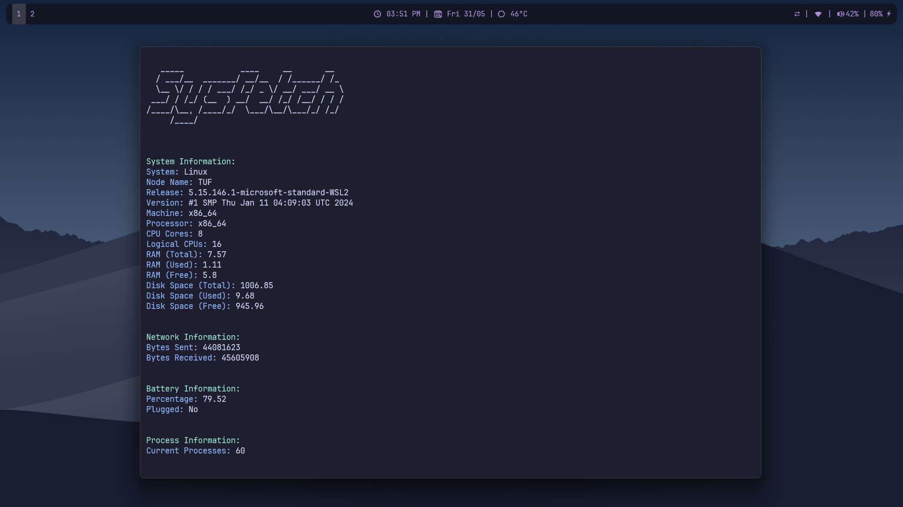

# Sysfetch
A simple script written in Python to fetch your System info



## ✨ Features
### ℹ️ System Information

- System: Operating System Name
- Node Name: Hostname of the machine
- Release: Operating System Release
- Version: Operating System Version
- Machine: Machine Type
- Processor: Processor Type
- CPU Cores: Number of Physical CPU Cores
- Logical CPUs: Number of Logical CPUs
- RAM (Total): Total RAM in GB
- RAM (Used): Used RAM in GB
- RAM (Free): Free RAM in GB

### 💽 Disk Information

- Disk Space (Total): Total Disk Space in GB
- Disk Space (Used): Used Disk Space in GB
- Disk Space (Free): Free Disk Space in GB

### 🌐 Network Information

- Bytes Sent: Total Bytes Sent over the Network
- Bytes Received: Total Bytes Received over the Network

### 🔋 Battery Information

- Percentage: Battery Percentage (if applicable)
- Plugged: Whether the device is plugged in or running on battery (Yes/No)

### 🔄 Process Information

- Current Processes: Number of Currently Running Processes


## 🚀 Usage

1. Clone this repo:
```bash
git clone https://github.com/ashish0kumar/System-fetch.git
```
  
2. Install the required dependencies:
```bash
pip install -r requirements.txt
```

3 You can now run the sysfetch.py script:
```bash
python sysfetch.py
```

## 📜 License
This project is licensed under the MIT License.
